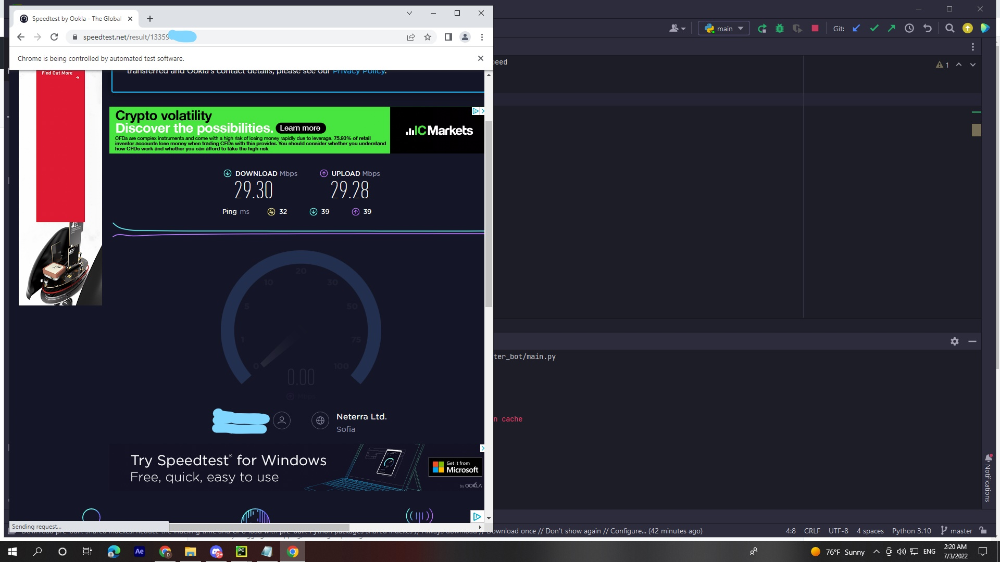
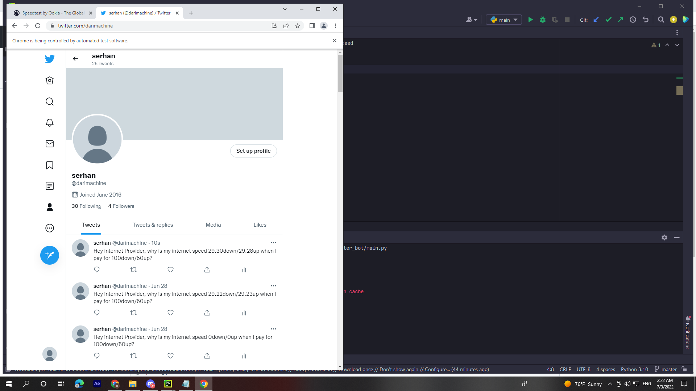

# twitter_bot
<h1>Getting hold the internet speed download and upload from speedtest and comparing to the required one.
Loging to the twitter account with all verifications and closing the save password option after that Tweeting message with your own internet speed and more...
</h1>
 </img>
 
 </img>

